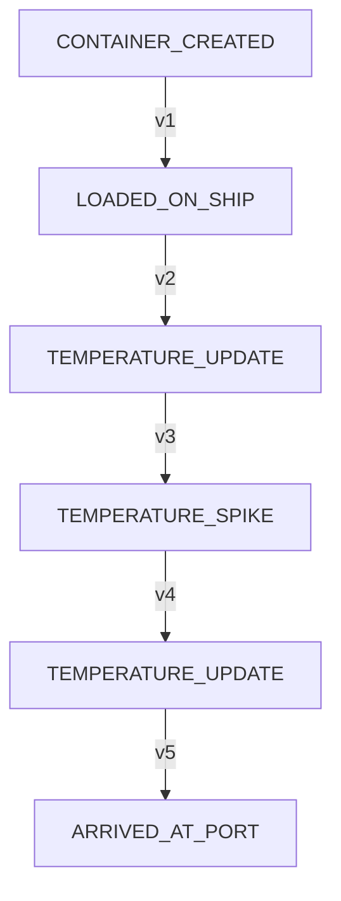

# Audit Trail — Event-Sourced Inventory & Logistics Ledger

> **Note:** This project is actively being developed and maintained.
**Audit Trail** is a full-stack MERN application demonstrating an **Event Sourcing** and **CQRS (Command Query Responsibility Segregation)** architecture for modern supply chain logistics. 

Instead of traditional CRUD operations that overwrite state, Audit Trail stores every state transition as an immutable, append-only domain event. The system reconstructs the current state of any container or shipment dynamically on-demand by folding (replaying) its historical event stream chronologically.

---

## Key Features

1. **Strict Immutability at Data-Access Layer:** No `UPDATE` or `DELETE` queries are permitted on the Event Store. The collection is append-only, enforced structurally at the schema-level using Mongoose query middleware hooks.
2. **CQRS Segmentation:** Clear separation between command routers (which accept actions, validate version state, and append new events) and query routers (which retrieve pre-projected read models or scrub state history).
3. **Optimistic Concurrency Control (OCC):** Prevents race conditions and stale writes. Commands assert an `expectedVersion` version token, and writes are rejected with an HTTP `409 Conflict` if the aggregate state has changed in the database since the client loaded the page.
4. **Time Travel / State Scrubbing:** Dynamic functional replay allows users to slide backward in time and query the reconstructed state of a container as of any past event timestamp.
5. **Interactive Dashboard:** Premium UI featuring:
   - Live search filters across logistics containers.
   - Dynamic time-scrubbing time travel slider.
   - Sensor metric overlay line charts built with Recharts.
   - Step-by-step color-coded chronological vertical timelines showing raw event payloads.
   - Command panels to dispatch new movement or temperature telemetry events.
   - Active OCC conflict mock testing triggers.

---

## Directory Structure

```
internship_project_3/
├── backend/
│   ├── src/
│   │   ├── config/
│   │   │   └── db.js                 # MongoDB connection
│   │   ├── models/
│   │   │   ├── EventStore.js         # Mongoose schema for the immutable event store (with OCC)
│   │   │   └── ShipmentReadModel.js  # Mongoose schema for the read-optimized projection
│   │   ├── routes/
│   │   │   ├── commands.js           # Write side router (POST /api/shipments/:id/commands)
│   │   │   └── queries.js            # Read side router (GET /api/shipments/...)
│   │   ├── services/
│   │   │   ├── commandHandlers.js    # Validates expected version and writes events
│   │   │   ├── projectionWorker.js   # Synchronizes read models immediately upon writes
│   │   │   └── replayEngine.js       # Replays/folds events to compute state (with asOf)
│   │   └── server.js                 # Express server entry point
│   ├── seed.js                   # Seeding script to populate sample containers
│   ├── test-verification.js      # Automated E2E verification test suite (29 tests)
│   ├── package.json
│   └── .env
└── frontend/                         # Vite-React frontend
    ├── src/
    │   ├── App.jsx                   # Main React Dashboard and state coordinator
    │   ├── index.css                 # Custom glassmorphic styling
    │   └── main.jsx                  # Entry mounting script
    ├── index.html                # Page entry template
    ├── package.json
    └── vite.config.js
```

---

## Domain Event Lifecycle

For a refrigerated container (e.g. `SHIP-001`), the state transitions through a sequence of events:


---

## Getting Started

### 1. Prerequisites
- **Node.js** (v18 or higher)
- **MongoDB** running locally on default port `27017` (`mongodb://127.0.0.1:27017/audit_trail`)

---

### 2. Backend Setup
1. Open a terminal and navigate to the backend folder:
   ```bash
   cd backend
   ```
2. Install dependencies:
   ```bash
   npm install
   ```
3. Populate database with seed data:
   ```bash
   npm run seed
   ```
4. Start the Express server:
   ```bash
   npm start
   ```
   The backend will be running at `http://127.0.0.1:5000`.

---

### 3. Running Automated Tests
To run the automated E2E test suite (which validates listing, detail lookups, temporal state scrubbing, OCC conflict rejections, and direct database write-once immutability constraints):
```bash
cd backend
node test-verification.js
```

---

### 4. Frontend Setup
1. Open a new terminal and navigate to the frontend folder:
   ```bash
   cd frontend
   ```
2. Install dependencies:
   ```bash
   npm install
   ```
3. Run the development server:
   ```bash
   npm run dev
   ```
   Open `http://localhost:5173/` in your browser to interact with the dashboard.
